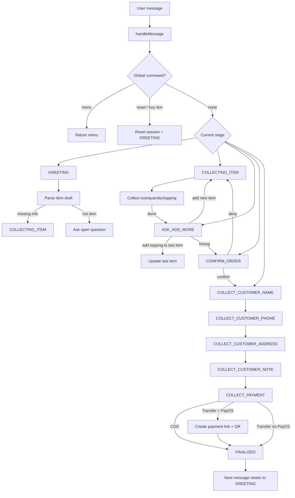

# Milk Tea Chatbot Backend (Node.js)

Backend chatbot bán hàng theo đúng quy trình trong `prompt.md`.

## 1) Cài đặt

```bash
npm install
```

## 2) Cấu hình

Tạo file `.env` từ `.env.example`:

```bash
PORT=3000
TELEGRAM_BOT_TOKEN=<your_telegram_bot_token_if_needed>
TELEGRAM_MODE=webhook # webhook hoặc polling
GEMINI_API_KEY=<your_gemini_api_key_if_needed>
GEMINI_MODEL=gemini-1.5-flash
PAYOS_CLIENT_ID=<your_payos_client_id_if_needed>
PAYOS_API_KEY=<your_payos_api_key_if_needed>
PAYOS_CHECKSUM_KEY=<your_payos_checksum_key_if_needed>
PAYOS_RETURN_URL=http://localhost:3000/payment/success
PAYOS_CANCEL_URL=http://localhost:3000/payment/cancel
APP_BASE_URL=http://localhost:3000
DB_PATH=./data/app.db
```

## 3) Chạy server

```bash
npm run dev
```

Hoặc:

```bash
npm start
```

## 4) API chính

- `GET /health`
- `GET /api/menu`
- `POST /api/chat`
- `POST /api/session/reset`
- `POST /webhooks/telegram` (tuỳ chọn, khi dùng Telegram)
- `POST /webhooks/payos` (nhận webhook thanh toán PayOS)

## Chạy với Telegram tự động trả lời

- `TELEGRAM_MODE=webhook`: dùng webhook (cần URL public).
- `TELEGRAM_MODE=polling`: bot tự đọc tin nhắn Telegram bằng long polling, không cần URL public.

Nếu chọn polling, chỉ cần `TELEGRAM_BOT_TOKEN` + chạy server là bot tự trả lời trên Telegram.

## Thanh toán QR PayOS

- Khi khách chọn `chuyển khoản`, hệ thống sẽ tự tạo link thanh toán PayOS + mã QR.
- Bot trả về cả `checkoutUrl` và `qrCode` để khách thanh toán.
- Sau khi PayOS gọi webhook `/webhooks/payos` với giao dịch thành công (`code = 00`), hệ thống sẽ cập nhật trạng thái đơn sang `paid`.

### Ví dụ `POST /api/chat`

```json
{
  "customerId": "user-001",
  "message": "TS01 size L x1 thêm TOP06"
}
```

## 5) Luồng hội thoại đã hỗ trợ

- Chào hỏi, mời xem menu hoặc đặt món.
- Thu thập món: tên/mã, size, topping, số lượng.
- Xác nhận đơn theo format tóm tắt.
- Thu thập thông tin giao hàng.
- Chọn thanh toán `COD` hoặc `transfer`.
- Xuất JSON đơn hàng nội bộ đúng schema trong prompt.

## 6) Lưu ý

- Trạng thái phiên đang lưu in-memory (`Map`) để demo nhanh.
- Muốn production: thay bằng Redis/DB để không mất session khi restart.
- Gemini là tùy chọn. Nếu có `GEMINI_API_KEY`, bot dùng LLM để hỗ trợ phân tích intent/thông tin đặt món.


## 7) Database (SQLite)

- Backend da dung SQLite that, khong con luu session/order chi trong RAM.
- File DB mac dinh: `./data/app.db` (co the doi bang bien moi truong `DB_PATH`).
- Session va order duoc giu lai sau khi restart server.

## 8) Flow (Mermaid)



## 9) Test tu dong

- Chay test:

```bash
npm test
```

- File test stage flow:
  - `tests/run-tests.js`
- Test gom cac scenario:
  - di qua day du cac stage voi COD + tu den lay
  - validate dia chi (input mo ho bi hoi lai)
  - huy don toan cuc o bat ky stage
  - bo sung topping cho mon vua them trong `ASK_ADD_MORE`
